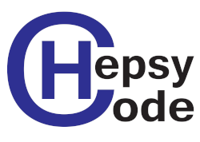

# HW/SW CO-DEsign of HEterogeneous Parallel dedicated SYstems (Hepsycode)

## Installation instructions

### OVERVIEW
Hepsycode is a prototypal tool to improve the design time of embedded applications. It is based on a System-Level methodology for HW/SW Co-Design of Heterogeneous Parallel Dedicated Systems. The whole framework drives the designer from an Electronic System-Level (ESL) behavioral model, with related NF requirements, including real-time and mixed-criticality ones, to the final HW/SW implementation, considering specific HW technologies, scheduling policies and Inter-Process Communication (IPC) mechanisms. The system behavior modeling language introduced in Hepsycode, named HML (HEPSY Modeling Language), is based on the Communicating Sequential Processes (CSP) Model of Computation (MoC). It allows modeling the behavior of the system as a network of processes communicating through unidirectional synchronous channels. By means of HML it is possible to specify the System Behavior Model (SBM), an executable model of the system behavior, a set of Non Functional Constraints (NFC) and a set of Reference Inputs (RI) to be used for simulation-based activities. Through the execution of different steps, including a system-level Design Space Exploration (DSE) approach that allows the related co-design methodology to suggest an HW/SW partitioning of the application specification and a mapping of the partitioned entities onto an automatically defined heterogeneous multi-processor architecture, it is possible to proceed with system implementation.

Hepsycode uses Eclipse MDE technologies, SystemC custom simulator implementation and an evolutionary genetic algorithm for partitioning activities, all integrated into an automatic framework that drive the designer from first input to final solution.

This repository contains the Hepsycode framework, which consists of a set of

- Reference libraries
- Scripts and makefiles
- Eclipse plugins 
- XML data exchange files
- SystemC files (part of the HEPSYM simulator)
- HW/SW Partitioning And Mapping (PAM) tool

Users can found more information in the docs/ folder.

### WEBSITE
www.hepsycode.com
 
### DOWNLOAD
Official git repository: https://bitbucket.org/vittorianomuttillo87/tool-hepsycode/src/master/
 
### INSTALLATION
 1. Download Eclipse Modelling Tool: https://www.eclipse.org/downloads/eclipse-packages/
 2. Installing from its Update Site (Modeling Package Updates for Eclipse Oxygen - http://www.eclipse.org/modeling/amalgam/downloads/package/modeling/oxygen/) in Eclipse the Modeling OXYGEN plugins
 3. Cloning Hepsycode from https://vittorianomuttillo87@bitbucket.org/vittorianomuttillo87/tool-hepsycode.git
 4. Import in eclipse Hepsycode projects present in folder "eclipse-plugin" and run a separate Eclipse application to run and debug Hepsycode plug-in
 5. Install systemc library (it is recommended version 2.3.0)
 6. Go to /home/.bashrc and insert the path of systemc (folder lib-linux and include) the names of variable must be SYSTEMCPATHLIB and SYSTEMCPATHINCLUDE for example:
    - export SYSTEMCPATHLIB=/usr/local/systemc-2.3.0a/lib-linux64
    - export SYSTEMCPATHINCLUDE=/usr/local/systemc-2.3.0a/include
    - Alternative: launch settings.sh script
 7. Try and enjoy Hepsycode Tool!!!

### SYSTEM REQUIREMENTS
 - Ubuntu 16.04.3 LTS (Xenial Xerus);
 - SystemC Libraries version 2.3.0;
 - Eclipse Oxygen Modelling Tools  with the following plugins in place: 
   - Oxygen.3a Release (4.7.3a)

### RELEASE NOTES
Latest Release: 1.0.0
 
### LICENSE
GNU GENERAL PUBLIC LICENSE Version 2, June 1991 (see https://www.gnu.org/licenses/old-licenses/gpl-2.0.html)
 
### DEVELOPER RESOURCES
Source Repositories: https://bitbucket.org/vittorianomuttillo87/tool-hepsycode/src/master/

- Clone: 
    - ssh: git@bitbucket.org:vittorianomuttillo87/tool-hepsycode.git
    - https: https://vittorianomuttillo87@bitbucket.org/vittorianomuttillo87/tool-hepsycode.git 
 
You can use the code from these repositories to experiment, test, build, and create patches, issue pull requests (only by request).
 
### SUPPORT
We currently support:

 1. Email: 
    - Luigi Pomante, luigi.pomante@univaq.it
    - Vittoriano Muttillo, vittoriano.muttillo@graduate.univaq.it
    - Giacomo Valente, giacomo.valente@graduate.univaq.it
    - (please take care to use \[HEPSYCODE SUPPORT\] as object
 2. Issues on bitbucket.org
 
## Getting started guidelines
You can find getting start guidelines at the link: www.hepsycode.com   
  
### EXAMPLES
We provide an example Hepsycode project, called FirFirGCD, a synthetic application that takes in input two values (triggered by some stimulus), makes two filtering actions (Fir8 and Fir16) and then makes the greatest common divisor (GCD) and displays the result.
More details details can be found at the link: www.hepsycode.com 

## Additional information
Research publications are available on http://www.hepsycode.com/ and http://www.pomante.net/sito_gg/Publications.htm
